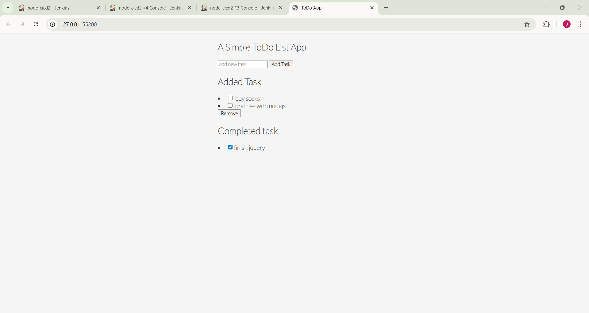

# Node.js CI/CD Pipeline with Docker, Jenkins & Kubernetes (Minikube)

  

# Project Overview

    This project demonstrates how to:

    Build a Node.js application

    Automate build & deployment using Jenkins

    Containerize the app using Docker

    Deploy and manage the application on Kubernetes (Minikube)

    Expose the application using NodePort Service

    The pipeline ensures continuous integration and continuous deployment whenever code is pushed to GitHub.

# Architecture
        Developer
        |
        |  Git Push
        ▼
        GitHub Repository
        |
        |  Webhook / Poll SCM
        ▼
        Jenkins CI/CD Pipeline
        |
        |-- Build Node.js App
        |-- Build Docker Image
        |-- Push Image to Docker Hub
        ▼
        Kubernetes (Minikube)
        |
        |-- Deployment
        |-- NodePort Service
        ▼
        Application accessible via Browser

# Tech Stack
        Category	Tools
        Language	Node.js
        CI/CD	Jenkins
        Containerization	Docker
        Container Registry	Docker Hub
        Orchestration	Kubernetes
        Local K8s Cluster	Minikube
        OS	Linux / Windows
        SCM	Git & GitHub
        📂 Project Structure
        nodejs-cicd/
        ├── Dockerfile
        ├── Jenkinsfile
        ├── package.json
        ├── index.js
        ├── k8s/
        │   ├── deployment.yaml
        │   └── service.yaml
        └── README.md

# Jenkins Pipeline (CI/CD)

    The Jenkins pipeline performs the following stages:

    Clone GitHub Repository

    Install Dependencies

    Build Docker Image

    Push Image to Docker Hub

    Deploy to Kubernetes (Minikube)

    Jenkinsfile Highlights
pipeline {
    agent any

    environment {
        DOCKER_IMAGE = "jayeshmdocker/nodejs-cicd"
    }

    stages {
        stage('Clone Repo') {
            steps {
                git 'https://github.com/Jaaayyyy/nodejs-cicd.git'
            }
        }

        stage('Build Docker Image') {
            steps {
                sh 'docker build -t $DOCKER_IMAGE:latest .'
            }
        }

        stage('Push Docker Image') {
            steps {
                sh 'docker push $DOCKER_IMAGE:latest'
            }
        }

        stage('Deploy to Kubernetes') {
            steps {
                sh 'kubectl apply -f k8s/'
            }
        }
    }
}
#  Docker Implementation
        Dockerfile
        FROM node:14-alpine

        WORKDIR /app

        COPY package*.json ./
        RUN npm install

        COPY . .

        EXPOSE 3000

        CMD ["npm", "start"]

        ✔ Lightweight Alpine image
        ✔ Production-ready container
        ✔ Port exposed for Kubernetes Service

        ☸️ Kubernetes Deployment
        Deployment

        Replicas ensure high availability

        Container runs on port 3000

        Image pulled from Docker Hub

        Service

        NodePort used to expose application

        Maps port 80 → 3000

        type: NodePort
        ports:
        - port: 80
            targetPort: 3000
            nodePort: 30226

# Accessing the Application
        Option 1: Using Minikube Service (Recommended)
        minikube service nodejs-cicd-service

        Option 2: Using NodePort
        minikube ip

        Open in browser:

        http://<minikube-ip>:30226

        Option 3: Port Forwarding
        kubectl port-forward svc/nodejs-cicd-service 3000:80

        http://localhost:3000

# Key DevOps Concepts Demonstrated

    ✔ CI/CD pipeline creation
    ✔ Docker image lifecycle
    ✔ Kubernetes deployments & services
    ✔ Debugging ImagePullBackOff & networking issues
    ✔ Minikube service exposure
    ✔ Infrastructure automation mindset

# What This Project Proves

    I can design & implement CI/CD pipelines

    I understand Docker & Kubernetes deeply

    I can debug real production-like issues

    I can deploy applications end-to-end without shortcuts

# Author

        Jayesh Malshikare
        Aspiring DevOps Engineer
        GitHub: https://github.com/Jaaayyyy